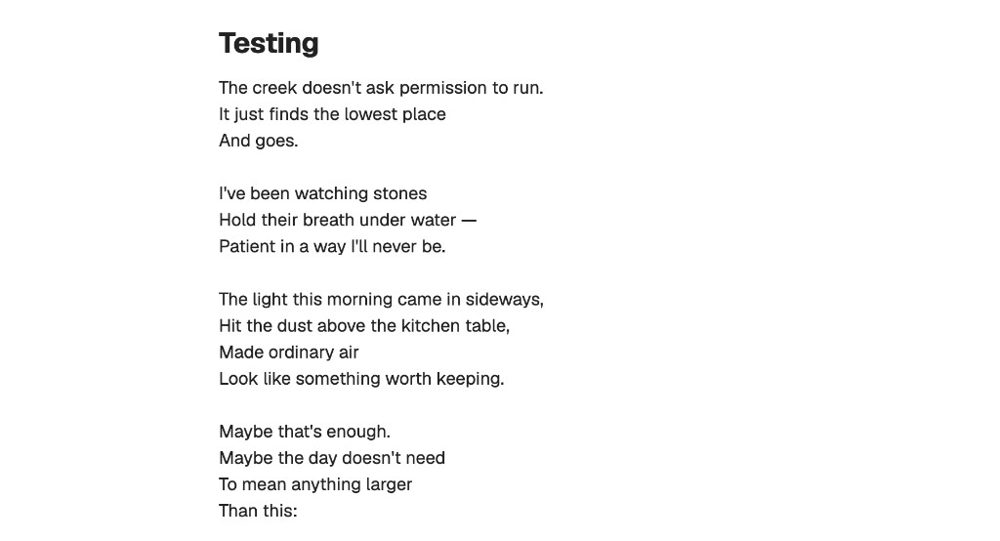
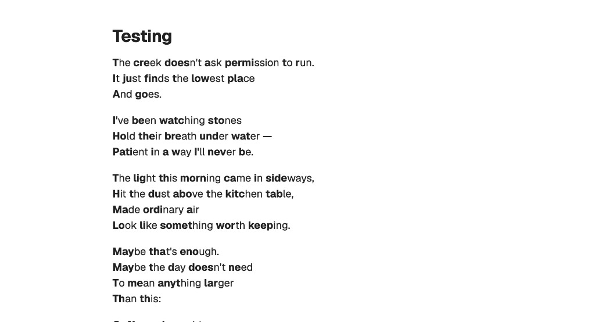

# Bionic Reading for Obsidian

An Obsidian plugin that applies a bionic reading effect in **Reading View** -- the first portion of each word is bolded, creating artificial fixation points that help your eyes glide through text faster.

## Before & After

**Before** -- normal Reading View:



**After** -- with Bionic Reading enabled:



## Features

- Works automatically in **Reading View** (source/editor mode is untouched)
- **Latin-only** -- only processes English and other Latin-alphabet text; Chinese, Japanese, Korean, and other scripts are left untouched
- Skips code blocks, inline code, math blocks, and SVG elements
- Non-destructive -- your markdown files are never modified
- Configurable fixation strength

## Settings

| Setting | Description |
|---------|-------------|
| **Enable bionic reading** | Toggle the effect on/off without uninstalling the plugin |
| **Fixation strength** | Slider from 1 (light) to 5 (heavy) -- controls how many letters per word are bolded |

## Installation

1. Download `main.js`, `manifest.json`, and `styles.css` from the [latest release](https://github.com/OMEG-Lu/obsidian-bionic-reading/releases/latest)
2. In your vault, create the folder `.obsidian/plugins/bionic-reading/`
3. Copy the three downloaded files into that folder
4. Open Obsidian, go to **Settings > Community plugins**, and turn off **Restricted mode** if it's on
5. Enable **Bionic Reading** in the plugin list
6. Open any note in **Reading View** to see the effect

## Development

```bash
npm install
npm run dev    # watch mode
npm run build  # production build
```
